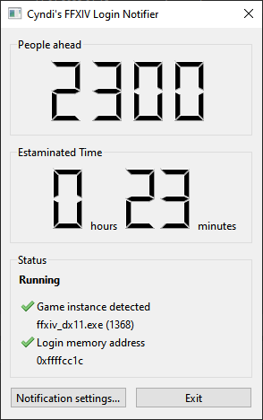

# XIVNotifier

Final Fantasy XIV Login Queue notifier.

Dokumentation ist in den folgenden Sprachen verfügbar: [English](README.md) [Deutsch](README.de.md)

## Sinn und Zweck

Seit dem Release von Endwalker sind die Loginzeiten oft ein Graus und dauern oft viele Stunden. Vermutlich ist dir das auch schon passiert: Du bist in der Loginqueue, gehst spazieren, kommst zurück und findest das Spiel im Intro wieder, weil du den Login verpasst hast und das Spiel dich zwischenzeitlich wieder ausgeloggt hat.

Mit diesem Tool kannst du dich über Messenger informieren lassen, wenn die Warteschlange unter eine bestimmte Anzahl fällt. Zusätzlich informiert es über die geschätzte Login-Dauer.

## Installation und Benutzung

* Downloade die neueste Version von [releases](https://github.com/vlohacks/XIVNotifier/releases/)
* Entpacke die ZIP-Datei wohin du willst
* Starte xivnotifier.exe
* Besorge dir einen CallMeBot API key und konfiguriere ihn zusammen mit deiner Handynummer im Programm unter "Notification Settings". Details unter [Infos zum Notification-Feature](#infos-zum-notification-feature)
* Starte FF14 und den Login-Prozess
* Hab eine gute Zeit, solange du auf den Login wartest :-)

## Infos zum Notification-Feature

XIVNotifier verwendet die CallMeBot API um Nachrichten über Signal oder WhatsApp zu schicken. Um dieses Feature nutzen zu können, musst du dort einen API Key erzeugen und zusammen mit deiner Handynummer im XIVNotifier eingeben.

Weitere Details hier für [Whatsapp](https://www.callmebot.com/blog/free-api-whatsapp-messages/) und [Signal](https://www.callmebot.com/blog/free-api-signal-send-messages/)

## FAQ
Q: Warum dauert es so lange, bis die geschätzte Zeit angezeigt wird?
A: Diese Information wird anhand Veränderungen der Loginqueue und den Zeitspannen dazwischen berechnet. Es braucht dafür mindestens 3 Veränderungen bei der Login-Queue. Sei einfach geduldig.

Q: Wie funktioniert das Teil?
A: Wie ein Parser. Es sucht die Login-Queue-Anzahl im Arbeitsspeicher des Spiels und pickt sich die Zahl raus.

Q: Hilfe! Der Login-Zähler zeigt komisches Zeug and und nicht das, was im Spiel steht!
A: Gratulation, du hast einen Bug gefunden! Bitte kontaktiere mich :-). Bis jetzt hat die Erkennung des Login-Zählers zuverlässig funktioniert, aber wenn das öfters passiert, muss ich das verbessern.

Q: Ich liebe dich! Ich will dir haufenweise Gil ingame geben!
A: Besuche mich auf Light/Shiva, Cynthia Cyber :-)

## Informationen und Rechtliches

Der Autor übernimmt keinerlei Haftung bei Benutzung dieser Software.

