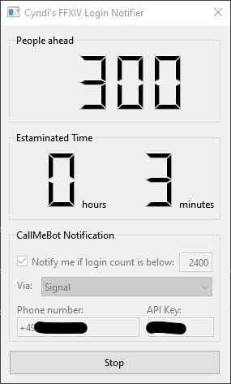

# XIVNotifier

Final Fantasy XIV Login Queue notifier.

Dokumentation ist in den folgenden Sprachen verfügbar: [English](README.md) [Deutsch](README.de.md)

## Sinn und Zweck

Seit dem Release von Endwalker sind die Loginzeiten oft ein Graus und dauern oft viele Stunden. Vermutlich ist dir das auch schon passiert: Du bist in der Loginqueue, gehst spazieren, kommst zurück und findest das Spiel im Intro wieder, weil du den Login verpasst hast und das Spiel dich zwischenzeitlich wieder ausgeloggt hat.

Mit diesem Tool kannst du dich über Messenger informieren lassen, wenn die Warteschlange unter eine bestimmte Anzahl fällt.

## Installation und Benutzung

* Downloade die neueste Version von [releases](https://github.com/vlohacks/XIVNotifier/releases/)
* Entpacke die ZIP-Datei wohin du willst
* Starte xivnotifier.exe
* Besorge dir einen CallMeBot API key und konfiguriere ihn zusammen mit deiner Handynummer im Programm. Details unter [Infos zum Notification-Feature](#infos-zum-notification-feature)
* Starte FF14 und den Login-Prozess
* Drücke den Start-Knopf im XIVNotifier
* Hab eine gute Zeit, solange du auf den Login wartest :-)

## Infos zum Notification-Feature

XIVNotifier verwendet die CallMeBot API um Nachrichten über Signal oder WhatsApp zu schicken. Um dieses Feature nutzen zu können, musst du dort einen API Key erzeugen und zusammen mit deiner Handynummer im XIVNotifier eingeben.

Weitere Details hier für [Whatsapp](https://www.callmebot.com/blog/free-api-whatsapp-messages/) und [Signal](https://www.callmebot.com/blog/free-api-signal-send-messages/)

## Informationen und Rechtliches

Der Autor übernimmt keinerlei Haftung bei Benutzung dieser Softwarety.

