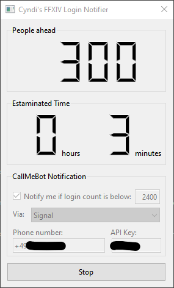

# XIVNotifier

Final Fantasy XIV Login Queue notifier

## Purpose

With the release of Endwalker, login queues are pain many times and last several hours. Maybe the same thing happened to you: You queued for login, saw 2500 people ahead of you, went for a walk, came back and found yourself in the intro cutsequence because you missed the login and got logged out again.

This tool allows you to get notified via messenger if the queue gets below a specific amount.

## Installation and usage

* Download the latest version from [releases](https://github.com/vlohacks/XIVNotifier/releases/)
* Unzip the file where you want
* Run xivnotifier.exe
* Obtain CallMeBot API key and configure notification options. Details can be found in [Notice on Notification Feature](#notice-on-notification-feature)
* Run FF14, start login process
* Hit start button
* Have some quality time while waiting for login :-)

## Notice on Notifictation Feature

XIVNotifier uses the CallMeBot API for notifying via Signal or WhatsApp Messenger. To use the feature, you need to create an API key for free. 

Details are here for [Whatsapp](https://www.callmebot.com/blog/free-api-whatsapp-messages/) and [Signal](https://www.callmebot.com/blog/free-api-signal-send-messages/)

## Release information and disclaimer

This software comes without warrany, use it at your own responsibility.

