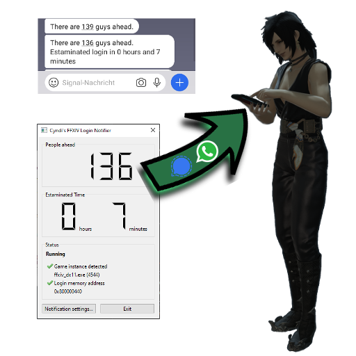

## Cyndi's FFXIV Login Notifier

Got large login queues in Final Fantasy 14, but still got a real life? Then this is the right tool for you, as it was for me!

* Get informed via eitherr WhatsApp or Signal when the game is about to log you in
* Get a broad estamination about how long the login takes

## Installation and Usage

* Download the latest release (zip) [here](https://github.com/vlohacks/XIVNotifier/releases/latest)
* Unpack it to a folder of your choice
* Get an API key for CallMeBot and configure it along with your mobile phone number 
* Run the game and queue for login
* Do other stuff instead of waiting in front of your Computer ;-)

